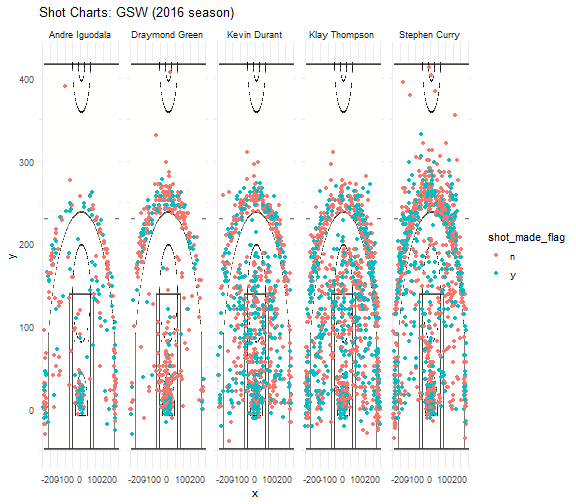

workout01-Arash-Nassirinia
================
Arash Nassirinia

``` r
library(dplyr)
```

    ## 
    ## Attaching package: 'dplyr'

    ## The following objects are masked from 'package:stats':
    ## 
    ##     filter, lag

    ## The following objects are masked from 'package:base':
    ## 
    ##     intersect, setdiff, setequal, union

``` r
library(ggplot2)
library(grid)
library(jpeg)
```

``` r
data_types = c("team_name"="character", "game_date"="character", "season" = "integer", "period"="integer",
               "minutes_remaining"="integer", "seconds_remaining"="integer", "shot_made_flag"="character",
               "action_type"="factor", "shot_type"="factor", "shot_distance"="integer", "opponent"="character",
               "x"="integer", "y"="integer","name"="character","shot"="factor","minute"="integer")
players <- read.csv('../data/shots-data.csv', stringsAsFactors = FALSE, colClasses=data_types)
```

``` r
two_pt <- players[players$shot_type=="2PT Field Goal",]
three_pt <- players[players$shot_type=="3PT Field Goal",]
```

``` r
two_grouped <- group_by(two_pt,name)
two_sum <- arrange(summarise(two_grouped, total=length(shot_made_flag),made=sum(shot_made_flag=='y'),
          perc_made = made/total), desc(perc_made))
two_sum
```

    ## # A tibble: 5 x 4
    ##   name           total  made perc_made
    ##   <chr>          <int> <int>     <dbl>
    ## 1 Andre Iguodala   210   134     0.638
    ## 2 Kevin Durant     643   390     0.607
    ## 3 Stephen Curry    563   304     0.540
    ## 4 Klay Thompson    640   329     0.514
    ## 5 Draymond Green   346   171     0.494

``` r
three_grouped <- group_by(three_pt,name)
three_sum <- arrange(summarise(three_grouped, total=length(shot_made_flag),made=sum(shot_made_flag=='y'),
          perc_made = made/total), desc(perc_made))
three_sum
```

    ## # A tibble: 5 x 4
    ##   name           total  made perc_made
    ##   <chr>          <int> <int>     <dbl>
    ## 1 Klay Thompson    580   246     0.424
    ## 2 Stephen Curry    687   280     0.408
    ## 3 Kevin Durant     272   105     0.386
    ## 4 Andre Iguodala   161    58     0.360
    ## 5 Draymond Green   232    74     0.319

``` r
all_grouped <- group_by(players,name)
all_sum <- arrange(summarise(all_grouped, total=length(shot_made_flag),made=sum(shot_made_flag=='y'),
          perc_made = made/total), desc(perc_made))
all_sum
```

    ## # A tibble: 5 x 4
    ##   name           total  made perc_made
    ##   <chr>          <int> <int>     <dbl>
    ## 1 Kevin Durant     915   495     0.541
    ## 2 Andre Iguodala   371   192     0.518
    ## 3 Klay Thompson   1220   575     0.471
    ## 4 Stephen Curry   1250   584     0.467
    ## 5 Draymond Green   578   245     0.424

``` r
#Report

"
Introduction: 
Have you ever seen Steph Curry's shots mapped out on a basketball court? No? Well in this project, you finally can! The purpose of this report is to explain how I came up with the shot charts and data about Andre Iguodala,
Draymond Green, Kevin Durant, Klay Thompson, and Stephen Curry.

Motivation:
The motivation behind this workout project is to use the data analysis skills we have been developing in stat 133 on a much more massive scale. We have the opportunity to work with a much more complex file structure and upload files to GitHub. 

Background:
We will be looking at 5 basketball players in the NBA:
- Andre Iguodala
- Graymond Green
- Kevin Durant
- Klay Thompson
- Stephen Curry
All 5 of these play for the Golden State warriors but some have different positions. To clarify different posiitons and different terms used throughout the workout project, I made a Data Dictionary in the data folder. Although many are self descriptive, some are not, so this dictionary is a very useful guide if one is not familiar with the column headers found in the .csv files for the data.

Data:
I used the curl function within terminal to download the shot data for the five players. Again, there a data dictionary that clarifies the column names. A few examples are:
1. x and y refer to the court coordinates (measured in inches) where a shot occurred.
2. team_name refers to the name of the NBA team.
3. game_date refers to the date that the game took place.
4. season is the NBA season during which the game took place.
5. Opponent is the team that they are playing against.
I then imported the data into the make-shots-data-script.R using the following code:
"
```

    ## [1] "\nIntroduction: \nHave you ever seen Steph Curry's shots mapped out on a basketball court? No? Well in this project, you finally can! The purpose of this report is to explain how I came up with the shot charts and data about Andre Iguodala,\nDraymond Green, Kevin Durant, Klay Thompson, and Stephen Curry.\n\nMotivation:\nThe motivation behind this workout project is to use the data analysis skills we have been developing in stat 133 on a much more massive scale. We have the opportunity to work with a much more complex file structure and upload files to GitHub. \n\nBackground:\nWe will be looking at 5 basketball players in the NBA:\n- Andre Iguodala\n- Graymond Green\n- Kevin Durant\n- Klay Thompson\n- Stephen Curry\nAll 5 of these play for the Golden State warriors but some have different positions. To clarify different posiitons and different terms used throughout the workout project, I made a Data Dictionary in the data folder. Although many are self descriptive, some are not, so this dictionary is a very useful guide if one is not familiar with the column headers found in the .csv files for the data.\n\nData:\nI used the curl function within terminal to download the shot data for the five players. Again, there a data dictionary that clarifies the column names. A few examples are:\n1. x and y refer to the court coordinates (measured in inches) where a shot occurred.\n2. team_name refers to the name of the NBA team.\n3. game_date refers to the date that the game took place.\n4. season is the NBA season during which the game took place.\n5. Opponent is the team that they are playing against.\nI then imported the data into the make-shots-data-script.R using the following code:\n"

``` r
data_types = c("team_name"="character", "game_date"="character", "season" = "integer", "period"="integer",
               "minutes_remaining"="integer", "seconds_remaining"="integer", "shot_made_flag"="factor",
               "action_type"="factor", "shot_type"="factor", "shot_distance"="integer", "opponent"="character",
               "x"="integer", "y"="integer")
curry <- read.csv("./data/stephen-curry.csv", stringsAsFactors = FALSE, colClasses=data_types)
thompson <- read.csv("./data/klay-thompson.csv", stringsAsFactors = FALSE, colClasses=data_types)
durant <- read.csv("./data/kevin-durant.csv", stringsAsFactors = FALSE, colClasses=data_types)
green <- read.csv("./data/draymond-green.csv", stringsAsFactors = FALSE, colClasses=data_types)
iguodala <- read.csv("./data/andre-iguodala.csv", stringsAsFactors = FALSE, colClasses=data_types)
```

``` r
"
After importing the data, I used logical subsetting to change shot_made_flag from n to shot no and from y to shot yes. Among some summaries, I then exported a new file called shots-data.csv into the data file.
After this step was done, I then created a make-shot-charts-script.R file to create visual representations of the players' shot data. I imported the shots-data.csv file:
"
```

    ## [1] "\nAfter importing the data, I used logical subsetting to change shot_made_flag from n to shot no and from y to shot yes. Among some summaries, I then exported a new file called shots-data.csv into the data file.\nAfter this step was done, I then created a make-shot-charts-script.R file to create visual representations of the players' shot data. I imported the shots-data.csv file:\n"

``` r
data_types = c("team_name"="character", "game_date"="character", "season" = "integer", "period"="integer",
               "minutes_remaining"="integer", "seconds_remaining"="integer", "shot_made_flag"="factor",
               "action_type"="factor", "shot_type"="factor", "shot_distance"="integer", "opponent"="character",
               "x"="integer", "y"="integer")
players <- read.csv('./data/shots-data.csv', stringsAsFactors = FALSE, colClasses=data_types)
```

``` r
"
After getting this data, I used the ggplot2 library to create visual representation of the courts and players' shot data. The code follows the same type of logic for each player. This was used to general Steph Curry's data:"
```

    ## [1] "\nAfter getting this data, I used the ggplot2 library to create visual representation of the courts and players' shot data. The code follows the same type of logic for each player. This was used to general Steph Curry's data:"

``` r
stephen <-players[players$name=="Stephen Curry",]
stephen_shot_chart <- ggplot(data = stephen) +
  annotation_custom(court_image, -250, 250, -50, 420) +
  geom_point(aes(x = x, y = y, color = shot_made_flag)) +
  ylim(-50, 420) +
  ggtitle('Shot Chart: Stephen Curry (2016 season)') +
  theme_minimal()
```

``` r
"After getting the plots for each player, I exported the graphs (mostly) as PDF's. This is how it was done for Steph Curry. Again, the code for other players follows the same logic:"
```

    ## [1] "After getting the plots for each player, I exported the graphs (mostly) as PDF's. This is how it was done for Steph Curry. Again, the code for other players follows the same logic:"

``` r
pdf('./images/stephen-curry-shot-chart.pdf', width=6.5,height=5)
stephen_shot_chart
dev.off()
```



``` r
"
Analysis:
Finally, we created a table that how many shots each player, shot, made, and the percentage that they made (perc_made) above. This shows us that in terms of two-pointers, Andre Iguodala had the highest perentage made (63.80952%), although Kevin Durant had the most made in total. For three pointers, Klay Thompson had the highest percentage made, and for all shots, Kevin Durant had the highest percentage made.

Discussion:
This table mixed with the graphs that we made using ggplot give us both visual and quantitative ways of interepreting the data. For example, the graph for Kevin Durant backs up what we found in our chart: it shows visually that most of his shots went in (because there are more green than red dots, and the green dots represent him making the shots).

Conclusions:
All five of the players we looked at are tremendous, but each have a different top strength. 

References:
The player data was found at: https://github.com/ucb-stat133/stat133-hws

Take-home message:
In terms of percentage made, Andre Iguodala performed the best at two pointers, Klay Thompson the best at three pointers, and Kevin Durant the best overall. This is made clear when looking at the graphs of all players shown earlier.
"
```

    ## [1] "\nAnalysis:\nFinally, we created a table that how many shots each player, shot, made, and the percentage that they made (perc_made) above. This shows us that in terms of two-pointers, Andre Iguodala had the highest perentage made (63.80952%), although Kevin Durant had the most made in total. For three pointers, Klay Thompson had the highest percentage made, and for all shots, Kevin Durant had the highest percentage made.\n\nDiscussion:\nThis table mixed with the graphs that we made using ggplot give us both visual and quantitative ways of interepreting the data. For example, the graph for Kevin Durant backs up what we found in our chart: it shows visually that most of his shots went in (because there are more green than red dots, and the green dots represent him making the shots).\n\nConclusions:\nAll five of the players we looked at are tremendous, but each have a different top strength. \n\nReferences:\nThe player data was found at: https://github.com/ucb-stat133/stat133-hws\n\nTake-home message:\nIn terms of percentage made, Andre Iguodala performed the best at two pointers, Klay Thompson the best at three pointers, and Kevin Durant the best overall. This is made clear when looking at the graphs of all players shown earlier.\n"
